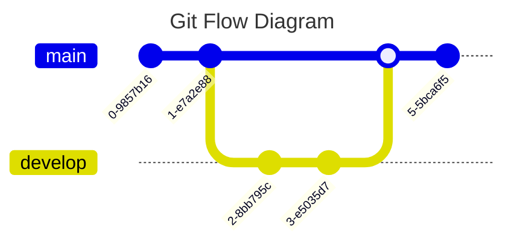

# 📝 Markdown

**Markdown** es un lenguaje de marcado que permite generar documentos de manera sencilla utilizando una sintaxis ligera, como ocurre con HTML o XML.

## 🔤 Títulos

Los títulos se crean usando el carácter `#` seguido del texto. El número de `#` determina el nivel del título:

```markdown
# Título 1
## Título 2
### Título 3
```

## 💬 Comentarios

Para agregar comentarios en Markdown se usa la siguiente sintaxis:

```html
<!-- Esto es un comentario -->
<!-- Para abrir el preview en algunos editores como VSCode, presiona F1 y busca Markdown Preview -->
<!-- Los saltos de línea se generan con un Enter -->
```

## ✏️ Estilizado de Texto

- *Itálica*:  
  `*Texto en itálica*` → *Texto en itálica*
- **Negrita**:  
  `**Texto en negrita**` → **Texto en negrita**
- ~~Tachado~~:  
  `~~Texto tachado~~` → ~~Texto tachado~~

## 📋 Listas

**Listas sin orden:**

```markdown
- Item 1
  - SubItem 1.1
- Item 2
```

- Item 1
  - SubItem 1.1
- Item 2

**Listas ordenadas:**

```markdown
1. Item 1
   1. SubItem 1
2. Item 2
```

1. Item 1  
   1. SubItem 1  
2. Item 2

## 🔗 Enlaces

- Básico:  
  `[Google](https://www.google.com/)` → [Google](https://www.google.com/)

- Con descripción emergente:  
  `[Google](https://www.google.com/ "Buscador de Google")` → [Google](https://www.google.com/ "Buscador de Google")

## 🗨️ Citas

Para agregar citas, usa el símbolo `>` al inicio de la línea:

```markdown
> "Esto es una cita"
```

> "Esto es una cita"

## 📄 Separador de Líneas

Para separar secciones, utiliza tres guiones (`---`):

```markdown
---
```

## 🖥️ Código

- **Línea de código**:  
  `` `print('Hola Mundo')` `` → `print('Hola Mundo')`

- **Bloque de código**:

  ```markdown
  def miFuncion():
      print('Hola Mundo')
  ```
  
  ```python
  def miFuncion():
      print('Hola Mundo')
   ```

## 📊 Tablas

```markdown
| Encabezado 1 | Encabezado 2 | Encabezado 3 |
| ------------ | ------------ | ------------ |
| Item 1       | Item 2       | Item 3       |
| Item 4       | Item 5       | Item 6       |
```

| Encabezado 1 | Encabezado 2 | Encabezado 3 |
| ------------ | ------------ | ------------ |
| Item 1       | Item 2       | Item 3       |
| Item 4       | Item 5       | Item 6       |

## 🖼️ Imágenes

- Desde URL:

  ```markdown
  
  ```

  

- Desde archivo local:

  ```markdown
  
  ```

## ✅ Tareas (Checklists)

Requiere un plugin como **Markdown Checkboxes**:

```markdown
- [x] Tarea 1
- [ ] Tarea 2
```

- [x] Tarea 1  
- [ ] Tarea 2  

## 👥 Menciones

Para mencionar a un usuario:

```markdown
@username
```

Ejemplo: @github

## 📈 Diagramas Mermaid

Con soporte de **Markdown Preview Mermaid Support**:




## 😃 Emojis

Usa la sintaxis de GitHub para emojis:

`:+1:` → 👍  
`:smiley:` → 😃

Lista completa: [GitHub Emoji Cheat Sheet](https://gist.github.com/rxaviers/7360908)

## 🧮 Matemáticas

Utiliza sintaxis LaTeX para ecuaciones:

```markdown
$$
E = mc^2
$$
```

$$
E = mc^2
$$

## 📚 Recursos adicionales

Para más información, consulta la [Documentación Markdown](https://github.com/adam-p/markdown-here/wiki/Markdown-Cheatsheet "Documentación Markdown").
